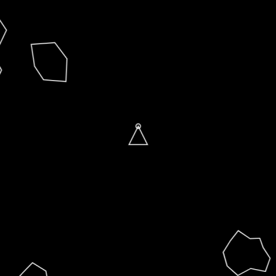

# Asteroid-Game

## Description
Asteroid Game is a classic arcade-style game where you control a spaceship and navigate through a field of asteroids, shooting them down to earn points. The objective is to survive as long as possible while racking up the highest score.

This game is a fun and challenging way to test your reflexes and hand-eye coordination. It's built using HTML5, CSS, and JavaScript, making it easily playable in any modern web browser.

## How to Play
* Use the arrow keys to move your spaceship.
* Press the spacebar to fire bullets and destroy asteroids.
* Avoid colliding with asteroids, as this will reduce your spaceship's health.
* Try to beat your highscore each time!

## License
This project is licensed under the MIT License - see the LICENSE.md file for details.

## Acknowledgments
We would like to thank the following open-source projects and resources for their contributions to Asteroid Game:

Enjoy the game!
